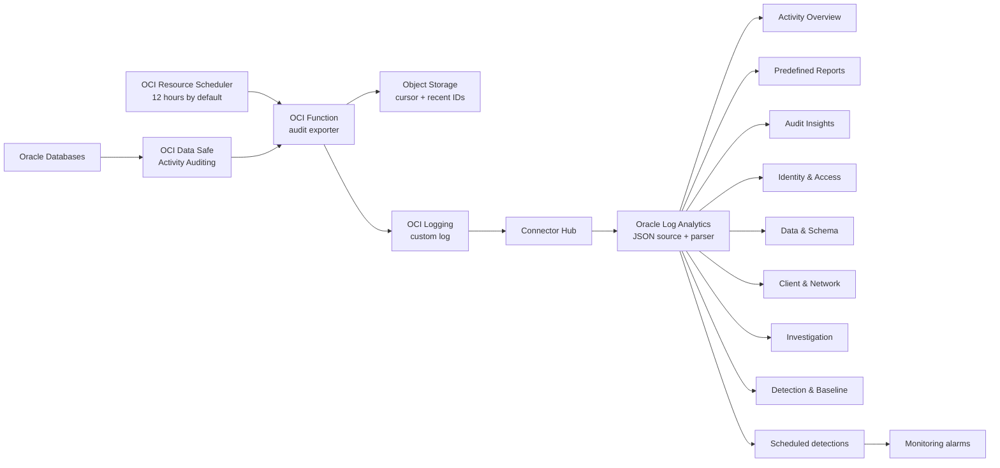
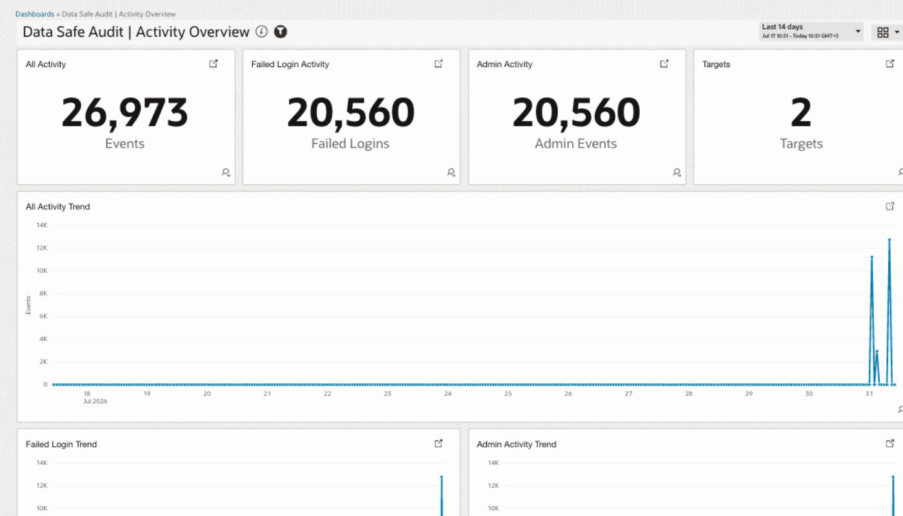

# OCI Data Safe audit logs in Oracle Log Analytics

Production-oriented reference implementation for exporting Oracle Database audit
events from **OCI Data Safe** into **OCI Logging**, routing them to **Oracle Log
Analytics**, and recreating the Data Safe Activity Auditing and Audit Insights
visualizations as an eight-view OCI Management Dashboard suite.

[](https://cloud.oracle.com/resourcemanager/stacks/create?zipUrl=https://github.com/adibirzu/oci-datasafe-log-analytics-dashboards/releases/latest/download/oci-datasafe-log-analytics-stack.zip)

This project starts from Oracle DevRel's
[`fn-datasafe-dbaudit-to-oci-logging`](https://github.com/oracle-devrel/technology-engineering/tree/main/oci-and-db/foundation/ciso/security-design/shared-assets/fn-datasafe-dbaudit-to-oci-logging)
reference and extends it through ingestion, field parsing, analytics, dashboards,
security controls, and E2E validation. See [docs/UPSTREAM.md](docs/UPSTREAM.md).

## What is included

- Data Safe Activity Auditing extraction using bounded SCIM queries.
- Lightweight Python function with no pandas dependency.
- Object Storage cursor with overlap, recent-ID deduplication, and ETag
  concurrency protection.
- Privacy defaults: SQL text and bind values excluded; client IPs
  pseudonymized with a deployment-specific salt.
- OCI Logging custom log and Connector Hub route to Oracle Log Analytics.
- Idempotent deployment of 43 Log Analytics fields, one JSON parser, and one
  custom source.
- 60 generated saved searches across eight named dashboard views:
  Activity Overview, Predefined Reports, Audit Insights, Identity & Access,
  Data & Schema, Client & Network, Investigation, and Detection & Baseline.
- Eight catalogued Log Analytics detection rules, eight Monitoring alarms, and
  native Data Safe Security/User Assessment baseline-drift notifications.
- All 15 predefined Data Safe Activity Auditing reports, plus additional
  investigation, error, identity, client, and network analytics.
- Terraform for Logging, Object Storage, Functions, Resource Scheduler,
  Connector Hub, and least-privilege IAM.
- Local unit, lint, dashboard-layout, Terraform, live-parser, ingestion, and
  dashboard-presence checks.

## Architecture



Connector Hub continuously supports OCI Logging as a source and Logging
Analytics as a target. Its Logging-source retention is 24 hours, so connector
health is part of the operational checks; it is not a historical backfill
mechanism.

## Dashboard coverage

The Activity Overview view recreates Data Safe's Failed Login Activity, Admin
Activity, All Activity, Events Summary, and Targets Summary surfaces. Audit
Insights recreates the eight key metrics and top-volume views for targets,
policies, schemas, objects, database users, and client hosts. The remaining
views add operator-friendly drilldowns without requiring SQL text.

See [docs/DASHBOARD_COVERAGE.md](docs/DASHBOARD_COVERAGE.md) for the exact
source-to-widget mapping.
See [docs/FIELD_CONTRACT.md](docs/FIELD_CONTRACT.md) for the complete
audit-event-to-Log-Analytics field contract and privacy exceptions.
See [docs/KB.md](docs/KB.md) for verified renderer, scope, scheduling, and
evidence-handling failure modes.

### Live-render validation



This cropped validation view proves that the saved searches render aggregate
Log Analytics data instead of empty or error tiles. Console chrome, OCIDs,
regions, database and target names, principals, IP addresses, filters, and
row-level drilldowns are intentionally excluded. Live validation also requires
all canonical queries, dashboards, scheduled detections, and alarms to pass;
the image alone is not end-to-end evidence.

## Prerequisites

- Data Safe is enabled and at least one target has an active audit trail.
- Oracle Log Analytics is onboarded in the same region.
- A Log Analytics log group, or permission for the stack to create one.
- An existing Functions subnet with access to OCI service endpoints.
- An immutable function image pushed to OCIR.
- OCI CLI and Terraform 1.5 or newer.
- Permission to create the resources in `terraform/`, including tenancy-level
  dynamic groups and policies when `create_iam_resources=true`.

Never put OCIDs, auth tokens, private keys, real IPs, database names, or live
error payloads in tracked files.

## Local verification

Use Python 3.11 or newer:

```bash
python3 -m venv .venv
. .venv/bin/activate
python -m pip install -e '.[dev]'
make verify
```

Read-only OCI readiness (source and solution compartments may differ):

```bash
python scripts/preflight.py --profile <OCI_PROFILE> \
  --data-safe-compartment-id '<DATA_SAFE_COMPARTMENT_OCID>' \
  --solution-compartment-id '<SOLUTION_COMPARTMENT_OCID>'
```

The output contains only counts and display-level tenancy context.

## Build and push the function

Build from the repository root so the image includes the shared package:

```bash
docker build --platform linux/arm64 \
  -f function/Dockerfile \
  -t '<REGION_KEY>.ocir.io/<NAMESPACE>/<REPOSITORY>:<IMMUTABLE_TAG>' .
docker push '<REGION_KEY>.ocir.io/<NAMESPACE>/<REPOSITORY>:<IMMUTABLE_TAG>'
```

Use a unique immutable tag or digest for every release.

## Deploy to OCI

Select the button above, choose the target compartments and Function subnet,
then choose the run interval. The default is `TWELVE_HOURS`; the stack also
offers one hour, six hours, one day, and a custom UTC cron. The release package
contains root-level Terraform, `schema.yaml`, the portable Log Analytics
content ZIP, and the generated dashboard bundle.

The stack creates or reuses the Log Analytics log group, imports fields,
parser, and source with overwrite semantics, imports dashboards with same-name
replacement, and provisions detection IAM, alarms, and drift-event routing. It
therefore updates this solution's content instead of creating duplicate
fields, parsers, sources, or dashboards. Run `scripts/deploy_all.py` for the
complete one-run flow that also reconciles the SDK-owned saved searches and
scheduled tasks; Resource Manager cannot execute that post-apply SDK phase.

Dashboard scope is supplied by reusable Log Group Compartment, Entity, and Time
Range filters. Embedded searches do not hard-code a LogGroup value. Table and
summary-table widgets retain Log Analytics `Add to Search` and `Exclude from
Search` pivots for target, user, operation, object, schema, client, and policy
drilldown.

## Local Terraform deployment

Create an untracked `terraform/terraform.tfvars` from the example and review the
plan:

```bash
cp terraform/terraform.tfvars.example terraform/terraform.tfvars
terraform -chdir=terraform init
terraform -chdir=terraform plan -out=plan.out
terraform -chdir=terraform apply plan.out
```

For one plan/apply/repair/acceptance run, use the wrapper with an untracked
variables file. Without `--apply`, it stops after producing and summarizing the
reviewed plan:

```bash
PYTHONPATH=src python3 scripts/deploy_all.py \
  --profile <OCI_PROFILE> \
  --data-safe-compartment-id <DATA_SAFE_COMPARTMENT_OCID> \
  --solution-compartment-id <SOLUTION_COMPARTMENT_OCID> \
  --deployment-name <DEPLOYMENT_NAME> \
  --tfvars terraform/terraform.tfvars \
  --apply
```

The wrapper applies the exact saved plan, repairs the two-phase Log Analytics
source/parser contract, reconciles detection searches and schedules, imports
the dashboard suite with duplicate cleanup, runs live
data/field/dashboard/detection acceptance, and finishes with strict redacted
discovery. Resource Manager uses the same generated root Terraform package
through the Deploy to OCI button; the SDK detection phase remains an explicit
post-apply operation.

After a Deploy-to-OCI stack succeeds, run the detection reconciliation from a
trusted operator workstation:

```bash
PYTHONPATH=src python scripts/deploy_detections.py \
  --profile <OCI_PROFILE> \
  --compartment-id <SOLUTION_COMPARTMENT_OCID> \
  --deployment-name <DEPLOYMENT_NAME> \
  --scope-compartment-id <SOLUTION_COMPARTMENT_OCID> \
  --interval PT5M
```

This command is idempotent and touches only the eight exact-name searches and
deployment-prefixed schedules in the catalog.

Read-only inventory and drift diagnosis:

```bash
PYTHONPATH=src python3 scripts/discover.py \
  --profile <OCI_PROFILE> \
  --data-safe-compartment-id <DATA_SAFE_COMPARTMENT_OCID> \
  --solution-compartment-id <SOLUTION_COMPARTMENT_OCID> \
  --deployment-name <DEPLOYMENT_NAME> \
  --strict
```

Terraform owns the Log Analytics content and dashboard imports. The scripts
remain available for focused repair or validation:

```bash
PYTHONPATH=src python scripts/setup_log_analytics_content.py \
  --profile <OCI_PROFILE> \
  --compartment-id '<COMPARTMENT_OCID>'

PYTHONPATH=src python scripts/deploy_dashboards.py \
  --profile <OCI_PROFILE> \
  --compartment-id '<COMPARTMENT_OCID>'
```

## Live E2E

Invoke the exporter, wait for Connector Hub ingestion, parse every query, and
verify all eight dashboards and the detection/alarm inventory:

```bash
PYTHONPATH=src python scripts/e2e.py \
  --profile <OCI_PROFILE> \
  --compartment-id '<COMPARTMENT_OCID>' \
  --invoke-function-id '<FUNCTION_OCID>' \
  --require-function-export \
  --deploy-dashboards
```

The receipt is written under ignored `evidence/live/`. E2E success requires a
real schema-v2 Log Analytics row, a positive Function export count when
`--require-function-export` is used, and, when deployment is requested, all
dashboards to be present. Query syntax success or HTTP 200 alone is not treated
as end-to-end proof.

## Scoped destroy

Destroy always creates and displays an exact Terraform destroy plan first.
Applying it requires an explicit deployment-name confirmation and then verifies
that Terraform state is empty and all eight exact-name suite dashboards are
absent:

```bash
python scripts/destroy_all.py \
  --profile <OCI_PROFILE> \
  --solution-compartment-id <SOLUTION_COMPARTMENT_OCID> \
  --deployment-name <DEPLOYMENT_NAME> \
  --tfvars <UNTRACKED_TFVARS_PATH>

python scripts/destroy_all.py \
  --profile <OCI_PROFILE> \
  --solution-compartment-id <SOLUTION_COMPARTMENT_OCID> \
  --deployment-name <DEPLOYMENT_NAME> \
  --tfvars <UNTRACKED_TFVARS_PATH> \
  --apply --confirm <DEPLOYMENT_NAME>
```

The cleanup matches only canonical suite names. It does not delete shared Log
Analytics fields, unrelated sources, external Notifications topics, or any
customer database content.

## Operations and security

- [docs/OPERATIONS.md](docs/OPERATIONS.md)
- [docs/SECURITY.md](docs/SECURITY.md)
- [docs/ARCHITECTURE.md](docs/ARCHITECTURE.md)
- [docs/VALIDATION.md](docs/VALIDATION.md)
- [docs/DETECTIONS.md](docs/DETECTIONS.md)
- [docs/DAM_MARKET_COVERAGE.md](docs/DAM_MARKET_COVERAGE.md)

## Official references

- [Export Oracle Database Audit Logs from Data Safe to OCI Logging](https://docs.oracle.com/en/learn/datasafe-audit-log-to-oci-logging/index.html)
- [Ingest Custom Logs from OCI Logging using Connector Hub](https://docs.oracle.com/en-us/iaas/log-analytics/doc/ingest-custom-logs-oci-logging-service-using-service-connector.html)
- [Data Safe Activity Auditing dashboard](https://docs.oracle.com/en-us/iaas/data-safe/doc/analyze-audit-events-activity-auditing-dashboard.html)
- [Data Safe Audit Insights](https://docs.oracle.com/en-us/iaas/data-safe/doc/audit-insights.html)
- [Create Log Analytics dashboards](https://docs.oracle.com/en-us/iaas/log-analytics/doc/create-dashboards.html)
- [Schedule OCI Functions](https://docs.oracle.com/en-us/iaas/Content/Functions/Tasks/functionsschedulingfunctions-about.htm)
- [Using the Deploy to Oracle Cloud button](https://docs.oracle.com/en-us/iaas/Content/ResourceManager/Tasks/deploybutton.htm)
