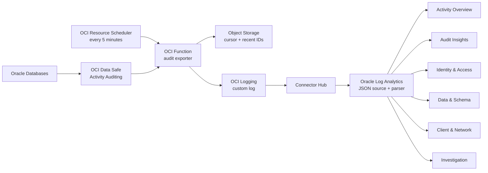

# OCI Data Safe audit logs in Oracle Log Analytics

Production-oriented reference implementation for exporting Oracle Database audit
events from **OCI Data Safe** into **OCI Logging**, routing them to **Oracle Log
Analytics**, and recreating the Data Safe Activity Auditing and Audit Insights
visualizations as a six-view OCI Management Dashboard suite.

This project starts from Oracle DevRel's
[`fn-datasafe-dbaudit-to-oci-logging`](https://github.com/oracle-devrel/technology-engineering/tree/main/oci-and-db/foundation/ciso/security-design/shared-assets/fn-datasafe-dbaudit-to-oci-logging)
reference and extends it through ingestion, field parsing, analytics, dashboards,
security controls, and E2E validation. See [docs/UPSTREAM.md](docs/UPSTREAM.md).

## What is included

- Data Safe Activity Auditing extraction using bounded SCIM queries.
- Lightweight Python function with no pandas dependency.
- Object Storage cursor with overlap, recent-ID deduplication, and ETag
  concurrency protection.
- Privacy defaults: SQL text and bind values excluded; client IPs
  pseudonymized with a deployment-specific salt.
- OCI Logging custom log and Connector Hub route to Oracle Log Analytics.
- Idempotent creation of 33 Log Analytics fields, one JSON parser, and one
  custom source.
- 37 generated saved searches across six named dashboard views:
  Activity Overview, Audit Insights, Identity & Access, Data & Schema,
  Client & Network, and Investigation.
- Terraform for Logging, Object Storage, Functions, Resource Scheduler,
  Connector Hub, and least-privilege IAM.
- Local unit, lint, dashboard-layout, Terraform, live-parser, ingestion, and
  dashboard-presence checks.

## Architecture



Connector Hub continuously supports OCI Logging as a source and Logging
Analytics as a target. Its Logging-source retention is 24 hours, so connector
health is part of the operational checks; it is not a historical backfill
mechanism.

## Dashboard coverage

The Activity Overview view recreates Data Safe's Failed Login Activity, Admin
Activity, All Activity, Events Summary, and Targets Summary surfaces. Audit
Insights recreates the eight key metrics and top-volume views for targets,
policies, schemas, objects, database users, and client hosts. The remaining
views add operator-friendly drilldowns without requiring SQL text.

See [docs/DASHBOARD_COVERAGE.md](docs/DASHBOARD_COVERAGE.md) for the exact
source-to-widget mapping.

## Prerequisites

- Data Safe is enabled and at least one target has an active audit trail.
- Oracle Log Analytics is onboarded in the same region.
- An existing Log Analytics log group.
- An existing Functions subnet with access to OCI service endpoints.
- An immutable function image pushed to OCIR.
- OCI CLI and Terraform 1.5 or newer.
- Permission to create the resources in `terraform/`, including tenancy-level
  dynamic groups and policies when `create_iam_resources=true`.

Never put OCIDs, auth tokens, private keys, real IPs, database names, or live
error payloads in tracked files.

## Local verification

Use Python 3.11 or newer:

```bash
python3 -m venv .venv
. .venv/bin/activate
python -m pip install -e '.[dev]'
make verify
```

Read-only OCI readiness (source and solution compartments may differ):

```bash
python scripts/preflight.py --profile cap \
  --data-safe-compartment-id '<DATA_SAFE_COMPARTMENT_OCID>' \
  --solution-compartment-id '<SOLUTION_COMPARTMENT_OCID>'
```

The output contains only counts and display-level tenancy context.

## Build and push the function

Build from the repository root so the image includes the shared package:

```bash
docker build --platform linux/arm64 \
  -f function/Dockerfile \
  -t '<REGION_KEY>.ocir.io/<NAMESPACE>/<REPOSITORY>:<IMMUTABLE_TAG>' .
docker push '<REGION_KEY>.ocir.io/<NAMESPACE>/<REPOSITORY>:<IMMUTABLE_TAG>'
```

Use a unique immutable tag or digest for every release.

## Deploy

Create an untracked `terraform/terraform.tfvars` from the example and review the
plan:

```bash
cp terraform/terraform.tfvars.example terraform/terraform.tfvars
terraform -chdir=terraform init
terraform -chdir=terraform plan -out=plan.out
terraform -chdir=terraform apply plan.out
```

Then create the Log Analytics field/parser/source contract and import the
dashboard suite:

```bash
PYTHONPATH=src python scripts/setup_log_analytics_content.py \
  --profile cap \
  --compartment-id '<COMPARTMENT_OCID>'

PYTHONPATH=src python scripts/deploy_dashboards.py \
  --profile cap \
  --compartment-id '<COMPARTMENT_OCID>'
```

## Live E2E

Invoke the exporter, wait for Connector Hub ingestion, parse every query, and
verify all six dashboards:

```bash
PYTHONPATH=src python scripts/e2e.py \
  --profile cap \
  --compartment-id '<COMPARTMENT_OCID>' \
  --invoke-function-id '<FUNCTION_OCID>' \
  --deploy-dashboards
```

The receipt is written under ignored `evidence/live/`. E2E success requires a
real Log Analytics row and, when deployment is requested, all dashboards to be
present. Query syntax success or HTTP 200 alone is not treated as end-to-end
proof.

## Operations and security

- [docs/OPERATIONS.md](docs/OPERATIONS.md)
- [docs/SECURITY.md](docs/SECURITY.md)
- [docs/ARCHITECTURE.md](docs/ARCHITECTURE.md)
- [docs/CAP_E2E.md](docs/CAP_E2E.md)

## Official references

- [Export Oracle Database Audit Logs from Data Safe to OCI Logging](https://docs.oracle.com/en/learn/datasafe-audit-log-to-oci-logging/index.html)
- [Ingest Custom Logs from OCI Logging using Connector Hub](https://docs.oracle.com/en-us/iaas/log-analytics/doc/ingest-custom-logs-oci-logging-service-using-service-connector.html)
- [Data Safe Activity Auditing dashboard](https://docs.oracle.com/en-us/iaas/data-safe/doc/analyze-audit-events-activity-auditing-dashboard.html)
- [Data Safe Audit Insights](https://docs.oracle.com/en-us/iaas/data-safe/doc/audit-insights.html)
- [Create Log Analytics dashboards](https://docs.oracle.com/en-us/iaas/log-analytics/doc/create-dashboards.html)
- [Schedule OCI Functions](https://docs.oracle.com/en-us/iaas/Content/Functions/Tasks/functionsschedulingfunctions-about.htm)
